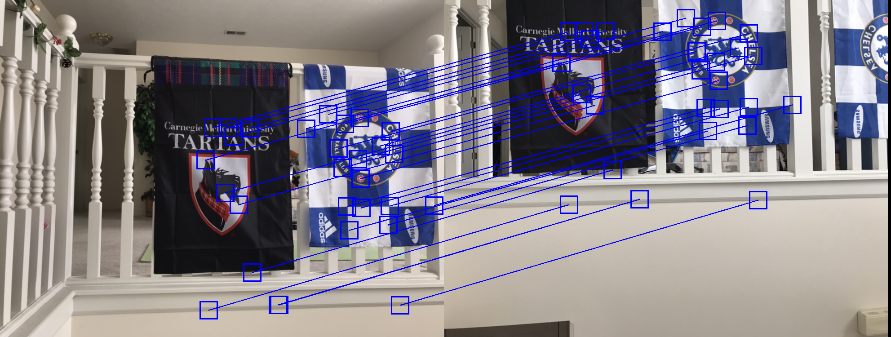

# Overview

This was a 1 week long project for a research lab coding challenge. 
The goal was to implement a program that finds matching feature descriptors between
two images and stitches the images together into a mosaic, while only using libraries 
for low-level functions such as loading/saving images and finding matrix inverses.

I first spend some days researching Harris Point Interest Detection, 
ANMS (Adaptive Non-Maximal Suppression), feature descriptor extraction, 
feature matching, RANSAC, warping images and stitching images together,
before I moved on to implement them. 

Since this was the first time I had used numpy, I had a bumpy start getting used to
its operations and broadcasting behaviors. But it was definitely worthwhile 
and cut down my program's speed by over x20 (with it iterating over 10,000's of
coordinates)! 

One unexpected result was that for my window example images, the matching
feature points before RANSAC (iterative method to get rid of outlier matches)
resulted in a cleaner mosaic than the set of inlier matching points after RANSAC. 
But this wasn't the case for the flag examples images.

Though it was a challenge, I had a lot of fun working on this project and had
a great time learning about all the interesting ways homographies are used to 
manipulate images all around us. I'm looking forward to work with them more on
future projects!

The language used in this project is Python, while using libraries numpy for array
operations and PIL Image for image loading/drawing/saving.

# Example Outputs

##Flag

Original Images

Matching Feature Descriptor Pairs

Mosaic

##Window

Original Images

Matching Feature Descriptor Pairs

Mosaic

